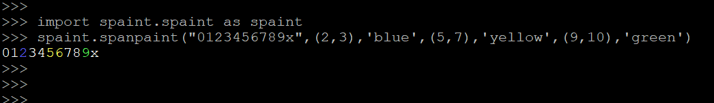

<!--[TOC]-->

# _spaint_
>__print colorful string in console__

# INSTALL
>__pip3 install spaint__

# USAGE
-----------------------------------------------------------------------

    import spaint.spaint as spaint

## spanpaint    
    #spaint.spanpaint(string,(start1,end1),color1,(start2,end2),color2,...)
    
    spaint.spanpaint("0123456789x",(2,3),'blue',(5,7),'yellow',(9,10),'green')

  
