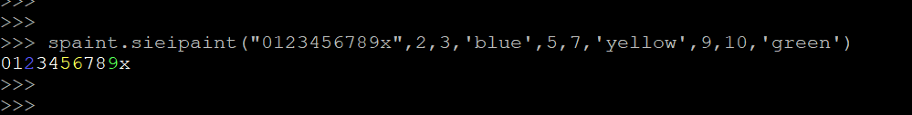
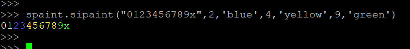
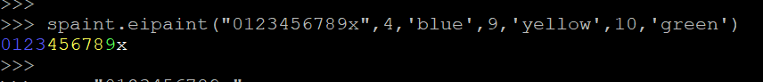
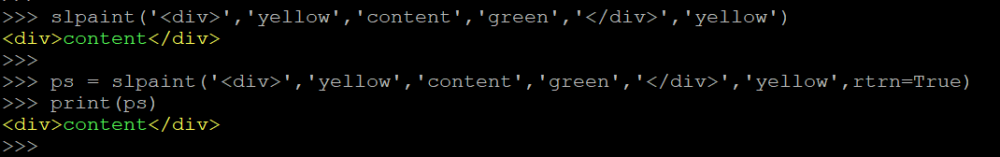
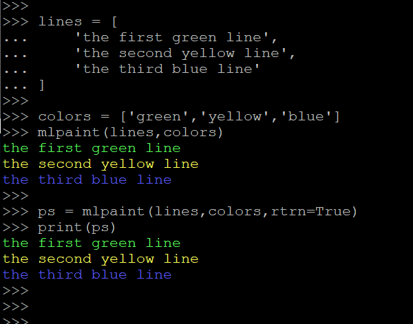
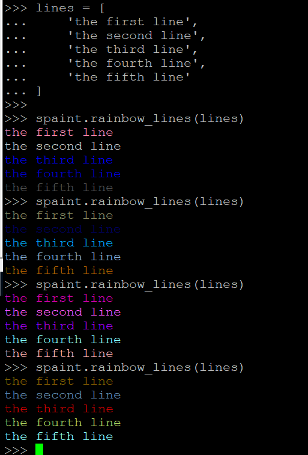
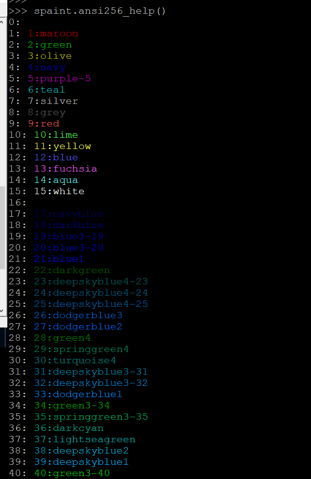

<!--[TOC]-->

# _spaint_
>__print colorful string in console__

# INSTALL
>__pip3 install spaint__

# USAGE
-----------------------------------------------------------------------

    import spaint.spaint as spaint

## spanpaint    
    #spaint.spanpaint(string,(start1,end1),color1,(start2,end2),color2,...)
    
    spaint.spanpaint("0123456789x",(2,3),'blue',(5,7),'yellow',(9,10),'green')

## sieipaint
    #spaint.sieipaint(string,start1,end1,color1,start2,end2,color2,...)
    
    spaint.sieipaint("0123456789x",2,3,'blue',5,7,'yellow',9,10,'green')

## sipaint
    #spaint.sipaint(string,start1,color1,start2,color2,...)    
    
    spaint.sipaint("0123456789x",2,'blue',4,'yellow',9,'green')

## eipaint
    #spaint.eipaint(string,end1,color1,end2,color2)
    
    spaint.eipaint("0123456789x",4,'blue',9,'yellow')

## slpaint
    #spaint.slpaint(word1,color1,word2,color2,.....)
    
    spaint.slpaint('
','yellow','content','green','
','yellow')

## mlpaint
    #spaint.mlpaint(lines,colors,**kwargs)
    
    lines = [
        'the first green line',
        'the second yellow line',
        'the third blue line'
    ]

    colors = ['green','yellow','blue']
    spaint.mlpaint(lines,colors)

    ps = spaint.mlpaint(lines,colors,rtrn=True)
    print(ps)

## rainbow
    #spaint.rainbow(word,interval,**kwargs)
    
    spaint.rainbow('colorful')
    spaint.rainbow('colorful')
    spaint.rainbow('colorful')
    spaint.rainbow('colorful',2)
    spaint.rainbow('colorful',2)
    spaint.rainbow('colorful',2)
    spaint.rainbow('colorful',rand=False)
    spaint.rainbow('colorful',rand=False)

## rainbow_lines
    #spaint.rainbow_lines(lines,interval,**kwargs)
    
    lines = [
        'the first line',
        'the second line',
        'the third line',
        'the fourth line',
        'the fifth line'
    ]
    
    spaint.rainbow_lines(lines)

## ansi8_

    spaint.ansi8_help()
    spaint.ansi8_test(95)
    spaint.ansi8_test('brightmagenta')
  

## ansi256_

    spaint.ansi256_help()
    spaint.ansi256_test(2)
    spaint.ansi256_test('green')
 

## win8_

  
